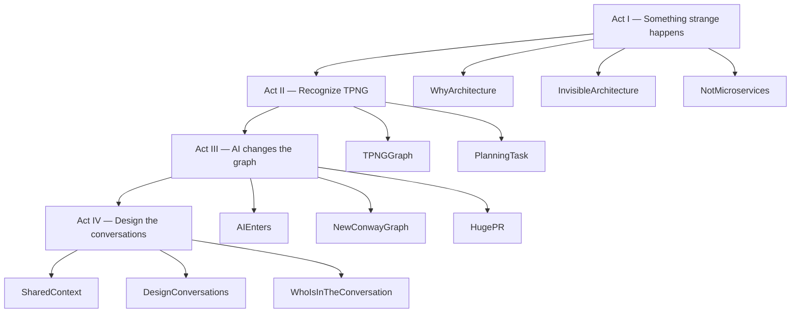

# Narrative, timings, and claims to verify

## Three-sentence summary

1. Software tends to mirror communication structure.
2. AI agents change that structure by creating powerful private human–machine channels.
3. Teams must therefore design both human communication and shared machine context — or they will encode an invisible graph into TPNG.

## Four acts



The motif **COMMUNICATION GRAPH → SOFTWARE GRAPH** appears in slides 2, 7, and 10. The closing question is: **What communication graph are we encoding into TPNG?**

## Slide index

| # | Scene | Act | ~time | Skip for 7 min |
|---|---|---|---|---|
| 1 | WhyArchitecture | I | 1:00 | no |
| 2 | InvisibleArchitecture | I | 1:15 | keep; don’t linger |
| 3 | NotMicroservices | I | 1:00 | one sentence on mismatch |
| 4 | TPNGGraph | II | 1:00 | no |
| 5 | PlanningTask | II | 1:15 | skip Inverse Conway aside |
| 6 | AIEnters | III | 1:00 | no |
| 7 | NewConwayGraph | III | 1:30 | jump to formula if needed |
| 8 | HugePR | III | 0:45 | keep if possible |
| 9 | SharedContext | IV | 1:00 | compress |
| 10 | DesignConversations | IV | 1:15 | speak 2–4 over clicks |
| 11 | WhoIsInTheConversation | IV | 0:45 | no |

Full talk ~11–12 minutes. Short path ~7 minutes.

## Remembered diagram

```text
        HUMAN ↔ HUMAN
          ↘     ↙
           AGENTS
             ↕
       SHARED CONTEXT
             ↓
          SOFTWARE
             ↕
        REAL WORLD
```

## Assumptions that need verification before presenting

These are framed as illustrations, not as historical claims. Confirm or soften before a wider TPNG audience:

1. **SPP split** — Graph Builder vs Stopping Point Recommender is used as an example of distinct responsibilities. Do **not** say the split was created because of Conway unless someone who was there confirms that.
2. **Order API subtypes** — DeliveryOrder / TransportOrder / HomeCollectionOrder and the “logical grouping” leak into DORA. Confirm names and that this is the story people will recognize.
3. **PlanningTask / adapter** — External contract → Adapter → DORA-owned `PlanningTask` is the intended correction. Confirm the current name (`EnrichedOrderAdapter` vs “Adapter”) if you want to be precise.
4. **PlanningTask fields** — `housekey`, `action_type`, `target_time_windows` are schematic, not a complete model.
5. **`tourpla-skills`** — used as the example of shared Copilot skills. Confirm the repo name and that it is still the place TPNG expects people to contribute `SKILL.md`.
6. **MCP surface** — Code, Confluence, Jira, GitHub matches the current Copilot / agent direction. Drop any connector that is not actually in use.
7. **Team boxes** — DORA / Optimizer / Sectorization plus DS / SWE / PO / BA are a cartoon of communication, not an org chart. Related planning/data teams are omitted on purpose.
8. **“15,000-line PR”** — a caricature of a failure mode, not a citation of a specific review.

Language to keep: *tends to*, *creates pressure*, *changes coordination cost*, *may amplify divergence*. Avoid: AI is destroying collaboration; microservices are better; monoliths violate Conway; agents must all share identical context.
