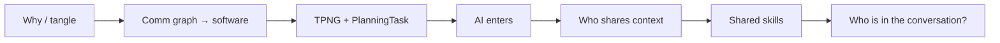

# Narrative, timings, and claims to verify

## Three-sentence summary

1. Software tends to mirror communication structure.
2. AI agents change that structure by creating powerful private human–machine channels.
3. Teams must design both human communication and shared machine context — or they encode an invisible graph into TPNG.

## Arc

Dropped from the longer draft: standalone microservices warning, full PlanningTask walkthrough, 15k-line PR gag, four-mechanism gallery. Those points are one line each on slides 2, 3, and 6.

## Slide index

| # | Scene | ~time |
|---|---|---|
| 1 | WhyArchitecture | 0:50 |
| 2 | InvisibleArchitecture | 1:00 |
| 3 | TPNGGraph | 1:00 |
| 4 | AIEnters | 1:00 |
| 5 | NewConwayGraph | 1:20 |
| 6 | SharedContext | 1:00 |
| 7 | WhoIsInTheConversation | 0:40 |

About 7 minutes.

## Assumptions to verify

1. SPP Graph Builder / Recommender is a responsibility split, not a Conway origin story.
2. External Order → Adapter → `PlanningTask` is the story people will recognize.
3. `tourpla-skills` is still the shared Copilot skills repo.
4. Team boxes are a cartoon of talk, not an org chart.

Language: *tends to*, *creates pressure*, *may amplify divergence*. Not: AI destroys collaboration; microservices are better.
